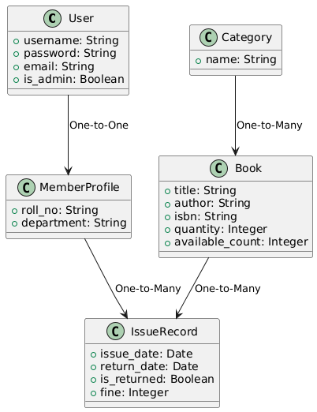
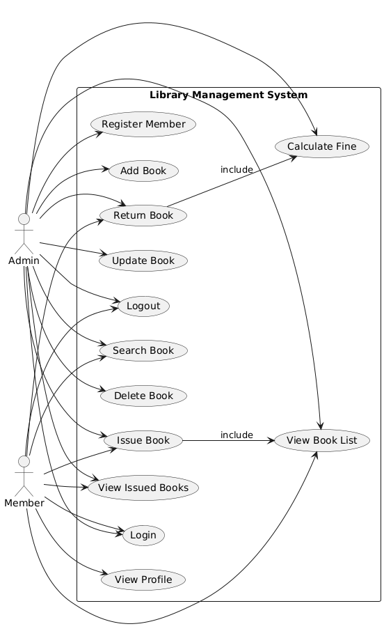
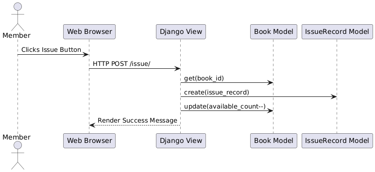
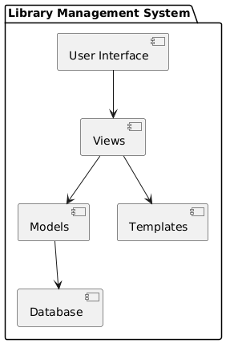

# Library Management System using Django

## Purpose

To clearly **define the goals, scope, users, and functions** of the system. You are the **customer** here — you will tell yourself exactly what the system should do.

---

## 1. **Project Title:**

**Library Management System (LMS)** using Django

---

## 2. **Objective:**

To build a web-based system that automates and manages the daily operations of a library such as managing books, members, issuing/returning books, and calculating fines.

---

## 3. **Scope of the Project:**

### In-Scope Features

* User authentication (login/signup)
* Add, update, delete books
* Search and filter books
* Issue and return books
* Fine calculation for late returns
* View all issued books
* Role-based access (Admin vs. Student/Member)

### Out of Scope (Optional for future)

* Barcode scanning
* Integration with SMS/email
* Payment gateway for fines
* Mobile app version

---

## 4. **Types of Users:**

| User Role | Description                                   |
| --------- | --------------------------------------------- |
| Admin     | Manages books, users, issues/returns, fines   |
| Student   | Searches books, checks status, issues/returns |

---

## 5. **Key Functional Requirements:**

| ID  | Feature                           | Priority |
| --- | --------------------------------- | -------- |
| FR1 | User registration and login       | High     |
| FR2 | Admin dashboard                   | High     |
| FR3 | Add/update/delete books           | High     |
| FR4 | Issue/return books                | High     |
| FR5 | Fine calculation for late returns | Medium   |
| FR6 | View and search book catalog      | High     |
| FR7 | View issued books by user         | Medium   |
| FR8 | Role-based access control         | High     |

---

## 6. **Non-Functional Requirements (Quality attributes):**

| NFR ID | Requirement                              |
| ------ | ---------------------------------------- |
| NFR1   | System should be accessible 24/7         |
| NFR2   | Passwords must be securely hashed        |
| NFR3   | System should respond within 3 seconds   |
| NFR4   | Code should follow Django best practices |
| NFR5   | User interface should be mobile-friendly |

---

## 7. **Constraints:**

* Built using Django framework
* Uses SQLite or PostgreSQL as the database
* Hosted on PythonAnywhere or Heroku (free tier)
* Completion deadline 2 Weeks

---

## 8. **Assumptions:**

* Only librarians (admins) can manage inventory.
* Each student can issue max 3 books at a time.
* Book return period is 14 days.

---

## 1. Class Diagram

The **class diagram** represents the key entities (models) in the system and their relationships. The system uses Django’s ORM, and the following classes (models) are defined:

### **Main Classes:**

* **User**: Inherits from Django’s built-in User model, extended via MemberProfile.
* **MemberProfile**: Stores additional student details like roll number and department.
* **Category**: Represents different book categories (e.g., Fiction, History).
* **Book**: Stores book details including title, author, ISBN, quantity, and availability.
* **IssueRecord**: Tracks the book issue and return process, including fine calculation.

**Relationships:**

* One-to-One between `User` and `MemberProfile`
* One-to-Many between `Category` and `Book`
* One-to-Many between `Book` and `IssueRecord`
* One-to-Many between `MemberProfile` and `IssueRecord`

---

## 2. Use Case Diagram

The **Use Case Diagram** models the system’s behavior from the users' perspective.

### **Actors:**

* **Admin**: Manages books, users, issues, returns, and fines.
* **Member**: Searches and issues books, views profile and issued books.

### **Key Use Cases:**

* Login, Logout
* Book Management (Add, Update, Delete)
* Book Browsing and Search
* Issue and Return Book
* Fine Calculation (included in Return process)
* View Issued Books
* View Profile

**Includes:**

* Returning a book includes fine calculation.
* Issuing a book includes book listing.

---

## 3. Sequence Diagram

The **Sequence Diagram** illustrates how objects interact during the **Book Issuing Process**.

### **Flow:**

1. The user selects a book to issue.
2. A request is sent to the server (Django View).
3. The view retrieves the book and creates an `IssueRecord`.
4. The available book count is decremented.
5. A response is rendered back to the user.

This helps visualize the order and direction of method calls and data flow during the issue process.

---

## 4. Activity Diagram

The **Activity Diagram** models the step-by-step logic behind the **Book Return** process, including decision-making and fine calculation:

1. The user initiates a return.
2. The system checks if the book is late.
3. If late, it calculates the fine.
4. The system updates the issue record and marks the book as returned.

---

## 5. Component Diagram

The **Component Diagram** outlines the architectural components of the Django application:

* **User Interface**: Browser-based HTML interface.
* **Views**: Django views handle request/response.
* **Models**: Define database logic and relationships.
* **Templates**: Rendered HTML pages.
* **Database**: SQLite or PostgreSQL used for persistence.

---

## 6. Design Decisions

* **MVT Architecture**: Django's MVT is used for clean separation of concerns.
* **Security**: Django handles authentication, CSRF protection, and password hashing.
* **Role-Based Access**: Admin vs Member access is clearly defined.
* **Modular Design**: Easy to scale (e.g., future integration of barcode scanning).

---

